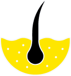

  

# C242-PS401 - Bangkit 2024 Capstone Team Project (AISkin)

Hello there! 👋 Welcome to the inspiring journey of team C242-PS401! We are a group of passionate innovators dedicated to transforming healthcare access and skin disease management with the power of AI and technology.

## 🩺 Project Overview

Our project, AISkin, leverages cutting-edge computer vision and machine learning technology to detect skin diseases and provide personalized medication recommendations. Users simply upload a photo of the affected skin area, and our intelligent algorithms identify the condition and suggest suitable treatments. Designed for accessibility and ease of use, AISkin empowers communities, particularly those with limited healthcare services, to take charge of their skin health.

## 🌍 Why It Matters

Skin diseases are a significant global health challenge, affecting 1.8 billion people worldwide, with tropical countries like Indonesia being particularly vulnerable (WHO, 2023). Limited access to dermatologists, high disease transmission risks, and inadequate healthcare resources make this issue even more critical. AISkin offers a practical, scalable solution, enabling early detection, preventing disease spread, and providing treatment recommendations using only a smartphone. By addressing these challenges, we aim to improve the well-being of underserved communities and advance global health equity.

## 🔍 How It Works

1. Image Analysis: Users upload a photo of their skin condition.
2. AI Detection: Our AI-powered model detects and classifies the disease.
3. Treatment Guidance: The app provides medication recommendations and tips for skin health.
4. Community Impact: By facilitating early detection, the app helps prevent disease spread and bridges healthcare gaps.

## 👥 Meet Our Extraordinary Team

Let us introduce you to the masterminds behind this groundbreaking project. Our diverse path learning and dedicated team brings together expertise in AI, healthcare and user experience. United by a common vision to create a useful capstone project, we work to provide solutions that improve quality of life, especially in the field of skin health.

| Learning Path      | Bangkit ID   | GitHub Link                                                    | LinkedIn Link                                                                             |
| ------------------ | ------------ | -------------------------------------------------------------- | ----------------------------------------------------------------------------------------- |
| Machine Learning   | M010B4KY2430 | [Matthew Gregorius](https://github.com/MatthewG314)            | [Matthew Gregorius](https://www.linkedin.com/in/matthewgregorius/)                        |
| Machine Learning   | M010B4KY2717 | [Muhammad Aliza Mudrikah](https://github.com/)                 | [Muhammad Aliza Mudrikah](https://www.linkedin.com/in/muhammad-aliza-mudrikah-0535681bb/) |
| Machine Learning   | M010B4KX4436 | [Vira Rahmawati](https://github.com/)                          | [Vira Rahmawati](https://www.linkedin.com/in/vira-rahmawati-8a3158239/)                   |
| Mobile Development | A156B4KY0022 | [Abdul Fatahillah](https://github.com/abdulsfat)               | [Abdul Fatahillah](https://www.linkedin.com/in/abdul-fatahillah-333539183/)               |
| Mobile Development | A156B4KY0466 | [Ammar Asysyakur](https://github.com/Amrasykr)                 | [Ammar Asysyakur](https://www.linkedin.com/in/ammar-asysyakur-876065252/)                 |
| Cloud Computing    | C156B4KY1061 | [Devandio Naufal Zuhair](https://github.com/devandioo)         | [Devandio Naufal Zuhair](https://www.linkedin.com/in/devandio-naufal-zuhair/)             |
| Cloud Computing    | C182B4KY3499 | [Pras Tio Rifki Wijaya](https://github.com/PrastioRifkiWijaya) | [Pras Tio Rifki Wijaya](https://www.linkedin.com/in/prastio-rifki-wijaya-046166243/)      |
